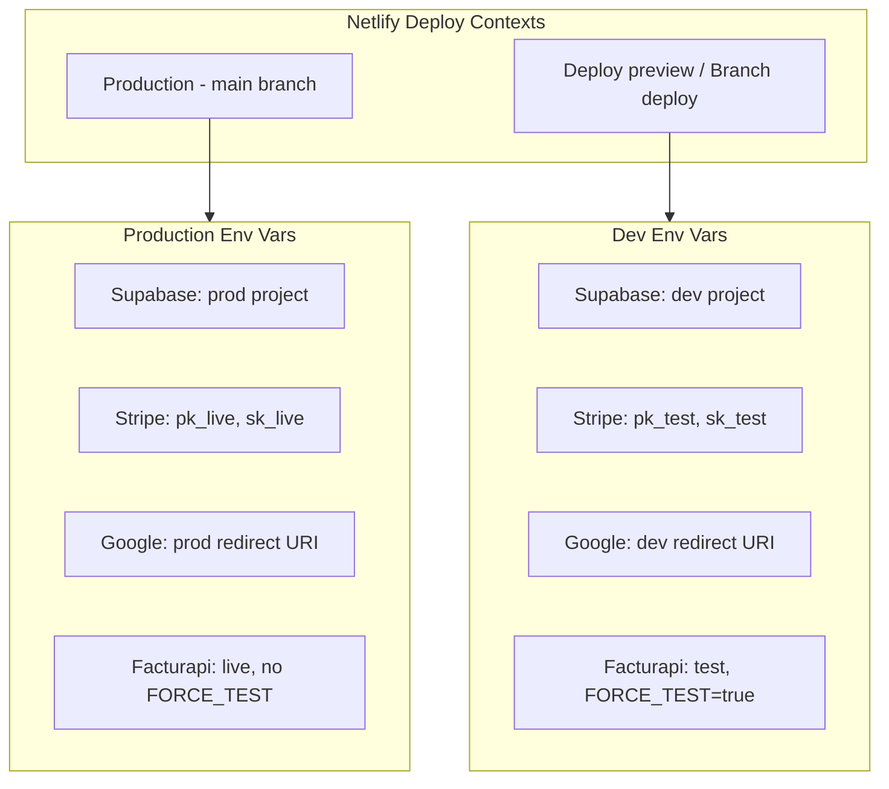

# Dev vs Prod Environment Setup

Reference plan for differentiating development and production environments using Netlify deploy contexts and branch-specific environment variables.

## Scope

- **Stripe**: Live keys in production, test keys in development
- **Google Calendar**: Production callback URL for prod, dev/preview URL for dev
- **Supabase**: Separate database projects for prod and dev
- **Facturapi**: Live mode in prod, test mode in dev (with per-clinic override support)
- **Resend** (document email): Optional per-context `RESEND_FROM` / domain
- **Other**: `facturapi-config`, `facturapi-webhook`, `view-document`, `send-document-email` all use Supabase; no code changes if env vars are set per context

---

## 1. Netlify Deploy Contexts

Use Netlify's deploy contexts to scope environment variables:

| Context | Triggers | Use for |
|---------|----------|---------|
| **Production** | Main branch (e.g. `main`) | Live app |
| **Deploy preview** | Pull requests | PR previews (dev config) |
| **Branch deploy** | Non-main branches (e.g. `develop`) | Dev/staging site |

**Configuration**: In Netlify Dashboard → Site Settings → Environment Variables, set variables with **scopes** (Production, Deploy previews, Branch deploys). Each key can have different values per scope.

---

## 2. Environment Variables by Service

### Supabase (Database)

| Variable | Production | Deploy preview / Branch deploy |
|----------|------------|--------------------------------|
| `VITE_SUPABASE_URL` | Prod project URL | Dev project URL |
| `VITE_SUPABASE_ANON_KEY` | Prod anon key | Dev anon key |
| `SUPABASE_URL` | Prod project URL | Dev project URL |
| `SUPABASE_SERVICE_ROLE_KEY` | Prod service role key | Dev service role key |

**Prerequisite**: Create a second Supabase project for development. Run migrations on both. Keep schemas in sync (e.g. via `supabase db push` on both).

### Stripe

| Variable | Production | Deploy preview / Branch deploy |
|----------|------------|--------------------------------|
| `VITE_STRIPE_PUBLISHABLE_KEY` | `pk_live_...` | `pk_test_...` |
| `STRIPE_SECRET_KEY` | `sk_live_...` | `sk_test_...` |
| `STRIPE_WEBHOOK_SECRET` | Live webhook secret | Test webhook secret |

**Stripe webhooks**:
- Prod: `https://your-prod-domain.netlify.app/.netlify/functions/stripe-webhook`
- Dev: `https://your-dev-branch.netlify.app/.netlify/functions/stripe-webhook` (or deploy preview URL)

Create separate webhook endpoints in Stripe Dashboard (one for prod, one for test).

### Google Calendar

| Variable | Production | Deploy preview / Branch deploy |
|----------|------------|--------------------------------|
| `VITE_GOOGLE_CLIENT_ID` | Same OAuth client (or separate) | Same or dev client |
| `VITE_GOOGLE_REDIRECT_URI` | `https://your-prod-domain.netlify.app/google-auth-callback` | `https://your-dev-site.netlify.app/google-auth-callback` |
| `GOOGLE_CLIENT_ID` | Same as VITE_ | Same |
| `GOOGLE_CLIENT_SECRET` | Prod secret | Dev secret (if separate client) |
| `GOOGLE_REDIRECT_URI` | Same as VITE_ | Same as VITE_ |

**Google Cloud Console**: Add both redirect URIs to your OAuth 2.0 Client (APIs & Services → Credentials):
- `https://your-prod-domain.netlify.app/google-auth-callback`
- `https://your-dev-site.netlify.app/google-auth-callback`
- `https://deploy-preview-*--your-site.netlify.app/google-auth-callback` (wildcard if supported) or add per-preview as needed
- `http://localhost:8888/google-auth-callback` (local)

**Files using these**: `src/hooks/useClinicGoogleCalendar.ts`, `src/integrations/google-calendar/clinic-service.ts`, `src/hooks/useGoogleCalendar.ts`, `netlify/functions/google-oauth.js`.

### Facturapi (CFDI)

| Variable | Production | Deploy preview / Branch deploy |
|----------|------------|--------------------------------|
| `FACTURAPI_TEST_SECRET` | Optional fallback | Test secret |
| `FACTURAPI_LIVE_SECRET` | Live secret | Empty or omit (force test) |
| `FACTURAPI_WEBHOOK_SECRET` | Prod webhook secret | Test webhook secret |
| `FACTURAPI_FORCE_TEST` | Omit or `false` | `true` |

**Current behavior** (`netlify/functions/facturapi.js`):
1. Prefer clinic keys from DB (`facturapi_test_secret`, `facturapi_live_secret`, `facturapi_use_live`)
2. Fallback: `NODE_ENV === 'production' && facturapiLive` → use live; else use test

**Issue**: `NODE_ENV` is `production` for all Netlify builds (including deploy previews). The fallback will pick live in deploy previews if `FACTURAPI_LIVE_SECRET` is set.

**Change**: Add a `FACTURAPI_FORCE_TEST` env var. When `FACTURAPI_FORCE_TEST=true`, always use test key in fallback. Set `FACTURAPI_FORCE_TEST=true` only in Deploy preview / Branch deploy scopes.

```js
// In getFacturapiKeyForClinic fallback section:
const forceTest = process.env.FACTURAPI_FORCE_TEST === 'true';
const useLiveEnv = !forceTest && process.env.NODE_ENV === 'production' && facturapiLive;
```

### Resend (Document Email)

| Variable | Production | Deploy preview / Branch deploy |
|----------|------------|--------------------------------|
| `RESEND_API_KEY` | Prod key | Test key or same |
| `RESEND_FROM` | `noreply@yourdomain.com` | `dev@yourdomain.com` or test domain |

**File**: `netlify/functions/send-document-email.js`

---

## 3. Local Development

Create `.env.local` (gitignored) with dev values:

```env
VITE_SUPABASE_URL=https://your-dev-project.supabase.co
VITE_SUPABASE_ANON_KEY=your_dev_anon_key
VITE_STRIPE_PUBLISHABLE_KEY=pk_test_...
VITE_GOOGLE_CLIENT_ID=your_google_client_id
VITE_GOOGLE_REDIRECT_URI=http://localhost:8888/google-auth-callback
```

For `netlify dev`, env vars can be loaded from Netlify UI (linked site) or from `.env` files.

### Document Email (Resend) – Local Testing

**Netlify functions (including `send-document-email`) only run when using `netlify dev`, not `npm run dev`.**

- Use `npm run dev:netlify` (or `netlify dev`) to test document email locally.
- Add `RESEND_API_KEY` and `RESEND_FROM` to `.env`.
- For basic testing without a custom domain: omit `RESEND_FROM` (uses `onboarding@resend.dev`) and send only to the email tied to your Resend account.

---

## 4. Files to Modify (When Implementing)

| File | Change |
|------|--------|
| `netlify/functions/facturapi.js` | Add `FACTURAPI_FORCE_TEST` check in `getFacturapiKeyForClinic` fallback |
| `.env.example` | Add `FACTURAPI_FORCE_TEST` and document dev vs prod |
| `docs/NETLIFY_DEPLOYMENT.md` | Document deploy-context setup, env var scoping, and per-service tables |

No changes needed for Supabase client, Stripe service, Google OAuth, or other functions if env vars are correctly scoped in Netlify.

---

## 5. Netlify Setup Checklist

1. **Supabase**: Create dev project; run migrations; add dev URLs/keys to Netlify for Deploy preview / Branch deploy.
2. **Netlify env vars**: For each variable, set Production value and Deploy preview / Branch deploy value in UI.
3. **Stripe**: Create test and live webhooks; set prod webhook for prod, test for dev.
4. **Google OAuth**: Add dev and prod redirect URIs in Google Cloud Console.
5. **Facturapi**: Set `FACTURAPI_FORCE_TEST=true` for Deploy preview / Branch deploy; add code change in `facturapi.js`.
6. **Resend**: Optionally use different `RESEND_FROM` per context.
7. **Branch strategy**: Use `main` for production deploys; use `develop` (or similar) for dev; configure Production context for `main` only.

---

## 6. Optional: Runtime Environment Helper

Create `src/lib/env.ts` for runtime checks (e.g. UI badges, debug logging):

```ts
export const isProd = () =>
  import.meta.env.PROD &&
  !window.location.hostname.includes('localhost') &&
  !window.location.hostname.includes('deploy-preview') &&
  !window.location.hostname.includes('branch--');
```

Use only if needed; env switching is done via Netlify scoping, not runtime logic.

---

## 7. Diagram


